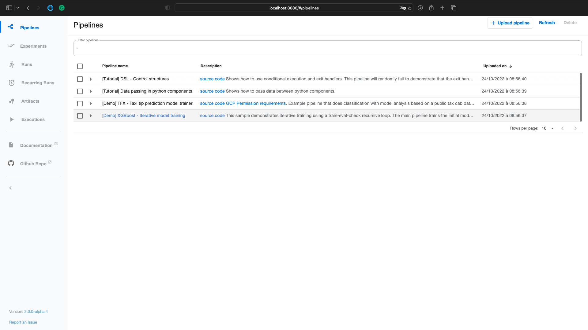

# Kubeflow pipeline 

This is a sample pipeline that demonstrates how to perform topic modeling using [Kubeflow Pipelines](https://www.kubeflow.org/docs/pipelines/overview/pipelines-overview/).

## Prerequisites
* kubectl
* Cluster (Minikube, docker desktop, ...)

## Install Kubeflow pipeline - local 

```shell
export PIPELINE_VERSION=1.8.5
kubectl apply -k "github.com/kubeflow/pipelines/manifests/kustomize/cluster-scoped-resources?ref=$PIPELINE_VERSION"
kubectl wait --for condition=established --timeout=60s crd/applications.app.k8s.io
kubectl apply -k "github.com/kubeflow/pipelines/manifests/kustomize/env/platform-agnostic-pns?ref=$PIPELINE_VERSION"
```

See if it's running correctly 
```
kubectl get pods -A 
```

### Port-forward 
```
kubectl port-forward -n kubeflow svc/ml-pipeline-ui 8080:80
```
Goto -> http://localhost:8080




## Pipeline:
* Two ways to run a pipeline:
  * Upload .yaml file
    * Example in 'old_pipeline.py'
  * Run via python script - client 
    * Example in './kubeflow/pipeline.py'


### Delete Kubeflow pipeline - local 
```
export PIPELINE_VERSION=1.8.5
kubectl delete -k "github.com/kubeflow/pipelines/manifests/kustomize/env/platform-agnostic-pns?ref=$PIPELINE_VERSION"
kubectl delete -k "github.com/kubeflow/pipelines/manifests/kustomize/cluster-scoped-resources?ref=$PIPELINE_VERSION"
```


***

## Install Kubeflow pipeline for Apple Silicon M1
https://medium.com/@fmind/how-to-install-kubeflow-on-apple-silicon-3565db8773f3
```shell
KFP_PLATFORM=platform-agnostic-emissary
KFP_VERSION=2.0.0b4
kubectl apply -k "github.com/kubeflow/pipelines/manifests/kustomize/cluster-scoped-resources?ref=$KFP_VERSION"
kubectl wait --for condition=established --timeout=60s crd/applications.app.k8s.io
kubectl apply -k "github.com/kubeflow/pipelines/manifests/kustomize/env/$KFP_PLATFORM?ref=$KFP_VERSION"
```

```
kubectl port-forward -n kubeflow svc/ml-pipeline-ui 8080:80
```

```
kubectl delete -k "github.com/kubeflow/pipelines/manifests/kustomize/cluster-scoped-resources?ref=$KFP_VERSION"
kubectl delete -k "github.com/kubeflow/pipelines/manifests/kustomize/env/$KFP_PLATFORM?ref=$KFP_VERSION"
```