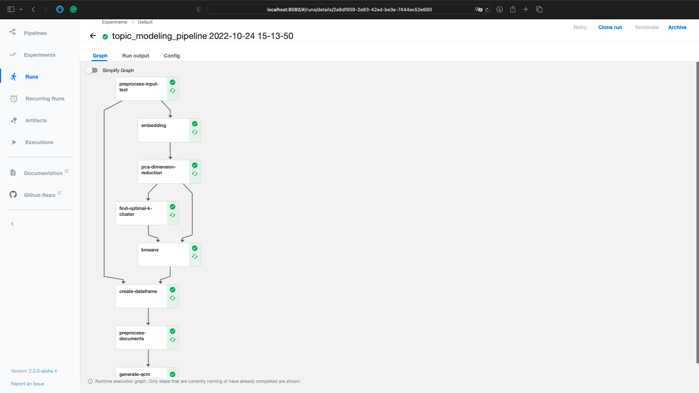
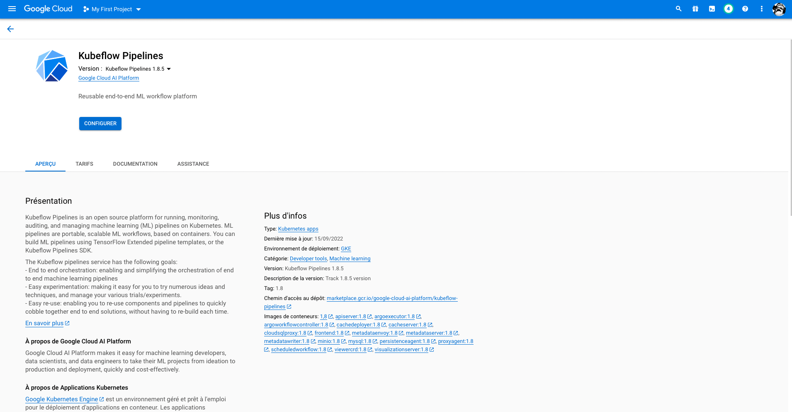
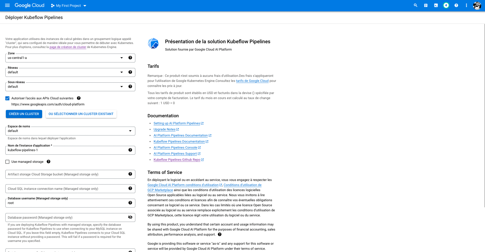
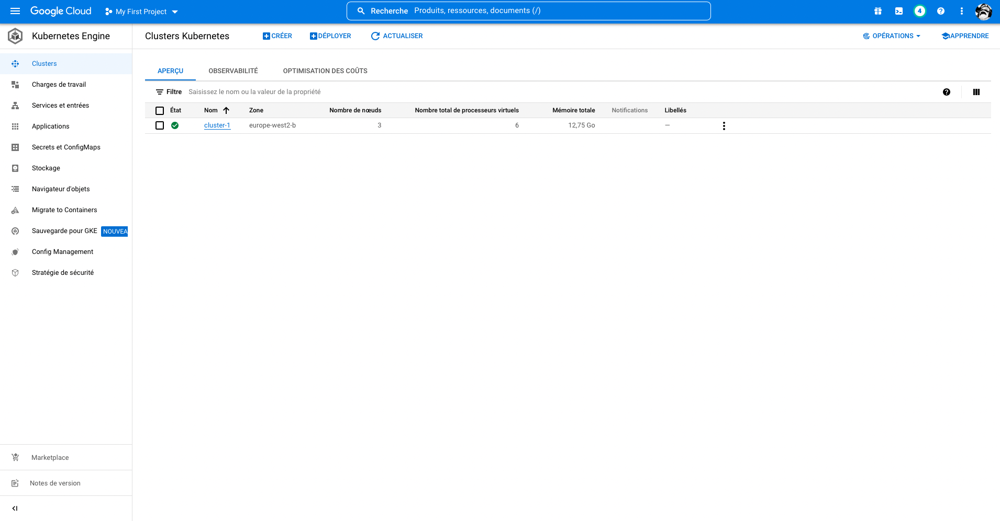
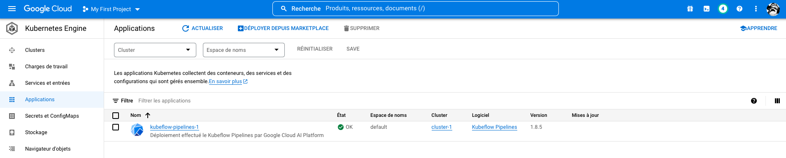
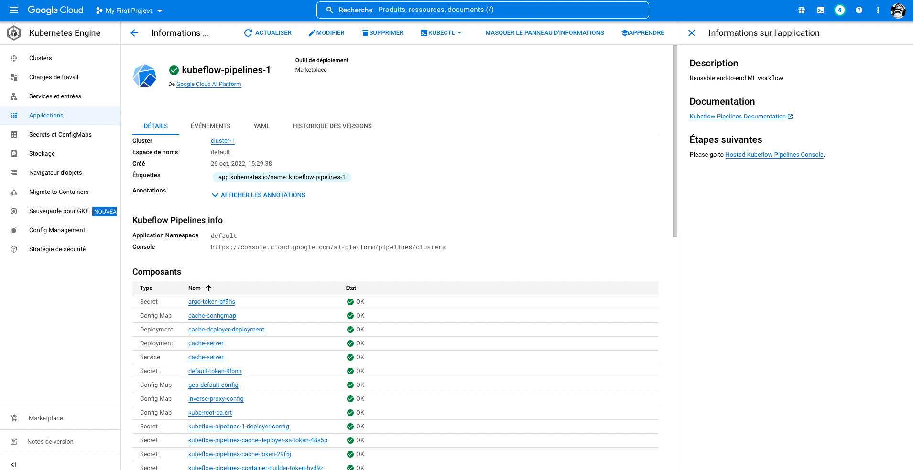
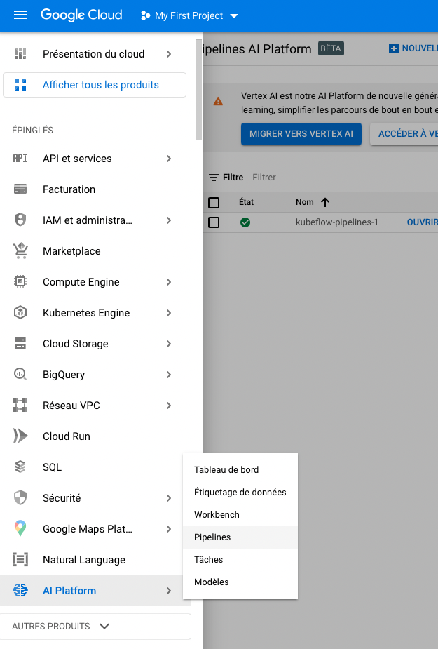
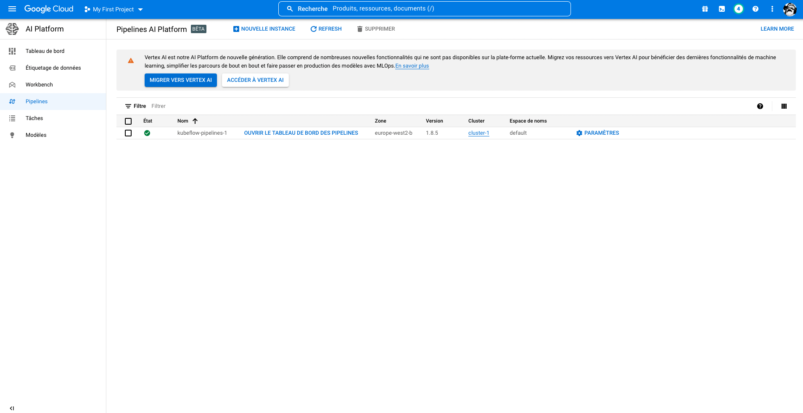
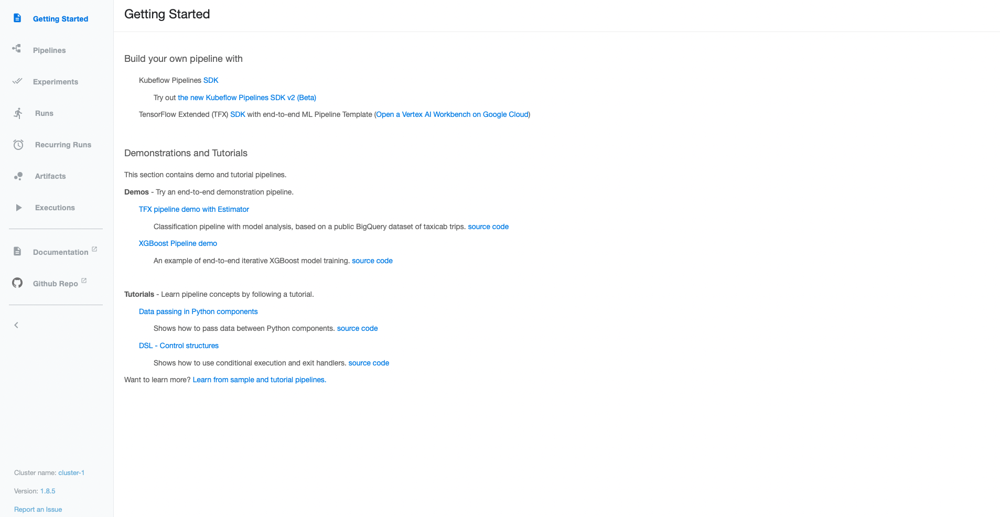
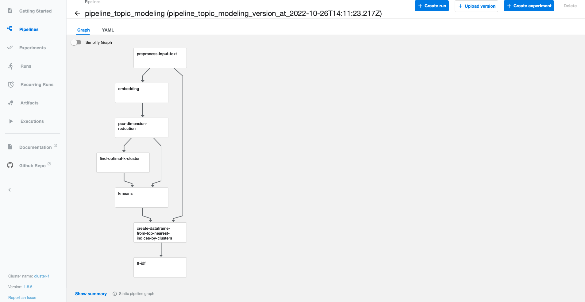

# Topic modeling - Kubeflow pipeline 

This is a sample pipeline that demonstrates how to perform topic modeling using [Kubeflow Pipelines](https://www.kubeflow.org/docs/pipelines/overview/pipelines-overview/).

[//]: # (## Prerequisites)

## Pipeline:

Preprocess input text -> Embedding -> PCA -> find optimal number of clusters -> K-means clustering -> create df from top nearest indices -> preprocess documents


## To create all images
Your docker user: 
```
export HUB_USER=thekenken
```

### To create: 
```shell
docker build -t $HUB_USER/preprocess_input_text preprocess_input_text/ && docker build -t $HUB_USER/embedding embedding/ && docker build -t $HUB_USER/pca pca/ && docker build -t $HUB_USER/find_optimal_number_of_clusters find_optimal_number_of_clusters/ && docker build -t $HUB_USER/kmeans kmeans/ && docker build -t $HUB_USER/create_df_from_top_nearest_indices create_df_from_top_nearest_indices/ && docker build -t $HUB_USER/preprocess_documents preprocess_documents/ && docker build -t $HUB_USER/tf_idf tf_idf/
```

### To push to docker hub:
https://docs.docker.com/docker-hub/repos/
```shell
docker push $HUB_USER/preprocess_input_text && docker push $HUB_USER/embedding && docker push $HUB_USER/pca && docker push $HUB_USER/find_optimal_number_of_clusters && docker push $HUB_USER/kmeans && docker push $HUB_USER/create_df_from_top_nearest_indices && docker push $HUB_USER/preprocess_documents && docker push $HUB_USER/tf_idf
```

## To run the pipeline:
```shell
python pipeline.py
```


# Run the pipeline on Google Cloud Platform 

## Prerequisites
* You must have a Google Cloud Platform (GCP) account. If you don't have a GCP account, you can create one [here](https://cloud.google.com/).
* You must have a GCP project. If you don't have a project, you can create one [here](https://console.cloud.google.com/projectcreate).

[//]: # (## Setup)

[//]: # (* Create a GCP service account and download the service account key. See the [GCP documentation]&#40;https://cloud.google.com/iam/docs/creating-managing-service-account-keys&#41; for more information.)

## Create a Kubeflow pipeline on GCP 
Search for "Kubeflow Pipelines" in the GCP Marketplace and click on the "Launch on Compute Engine" button.


You can also create a cluster when you configure the Kubeflow Pipelines application.
Make sure to give access of APIs Cloud. 

It can take few minutes to create the cluster.
Go to "Kubenetes Engine" in the GCP console and check if the cluster is created.


If it's create you can go to the Kubeflow Pipelines dashboard. Go to **Applications** 

You can see all the details of the Kubeflow Pipelines application. If it's all green you can go to the dashboard.


To access the Kubeflow Pipelines dashboard, you have to go to "AI Platform" and click to "Pipelines". 



You should see the Kubeflow Pipelines dashboard like this:


## Run the pipeline on GCP
***
### Create new images and push to docker hub (Optional) 
Local: If you are on Apple Silicon M1, you need to rebuild the images locally and push to docker hub. Because the architecture on GCP is not an arm64. 
https://medium.com/geekculture/from-apple-silicon-to-heroku-docker-registry-without-swearing-36a2f59b30a3

```shell
docker buildx build --platform linux/amd64 -t $HUB_USER/preprocess_input_text preprocess_input_text/ && docker buildx build --platform linux/amd64 -t $HUB_USER/embedding embedding/ && docker buildx build --platform linux/amd64 -t $HUB_USER/pca pca/ && docker buildx build --platform linux/amd64 -t $HUB_USER/find_optimal_number_of_clusters find_optimal_number_of_clusters/ && docker buildx build --platform linux/amd64 -t $HUB_USER/kmeans kmeans/ && docker buildx build --platform linux/amd64 -t $HUB_USER/create_df_from_top_nearest_indices create_df_from_top_nearest_indices/ && docker buildx build --platform linux/amd64 -t $HUB_USER/preprocess_documents preprocess_documents/ && docker buildx build --platform linux/amd64 -t $HUB_USER/tf_idf tf_idf/ && docker push $HUB_USER/preprocess_input_text && docker push $HUB_USER/embedding && docker push $HUB_USER/pca && docker push $HUB_USER/find_optimal_number_of_clusters && docker push $HUB_USER/kmeans && docker push $HUB_USER/create_df_from_top_nearest_indices && docker push $HUB_USER/preprocess_documents && docker push $HUB_USER/tf_idf
```
***

## Upload Pipeline to GCP 
Go to the Kubeflow Pipelines dashboard and click on "Upload pipeline" and upload the pipeline_topic_modeling.yaml file.


## Run the pipeline on GCP
You can start a run of the pipeline by clicking on "Create a run" and put a paragraph.
Example of a paragraph:
```text 
The Elder Scrolls V: Skyrim is an action role-playing video game developed by Bethesda Game Studios and published by Bethesda Softworks. It is the fifth main installment in The Elder Scrolls series, following The Elder Scrolls IV: Oblivion.The game's main story revolves around the player character's quest to defeat Alduin the World-Eater, a dragon who is prophesied to destroy the world. The game is set 200 years after the events of Oblivion and takes place in the fictional province of Skyrim. Over the course of the game, the player completes quests and develops the character by improving skills. The game continues the open-world tradition of its predecessors by allowing the player to travel anywhere in the game world at any time, and to ignore or postpone the main storyline indefinitely.The team opted for a unique and more diverse open world than Oblivion's Imperial Province of Cyrodiil, which game director and executive producer Todd Howard considered less interesting by comparison. The game was released to critical acclaim, with reviewers particularly mentioning the character advancement and setting, and is considered to be one of the greatest video games of all time.
```